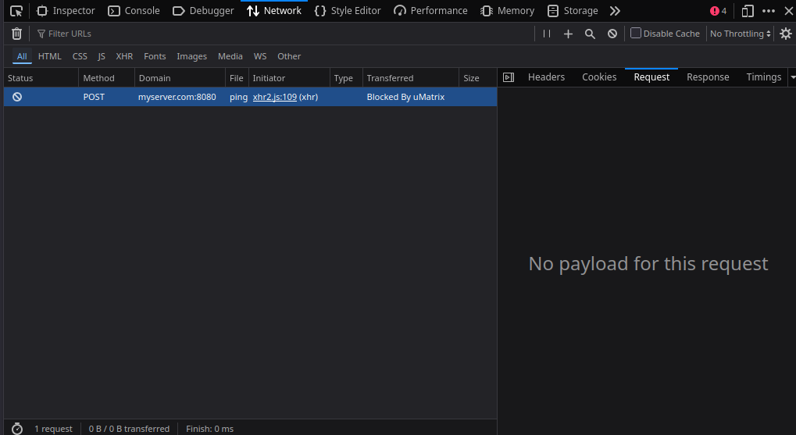
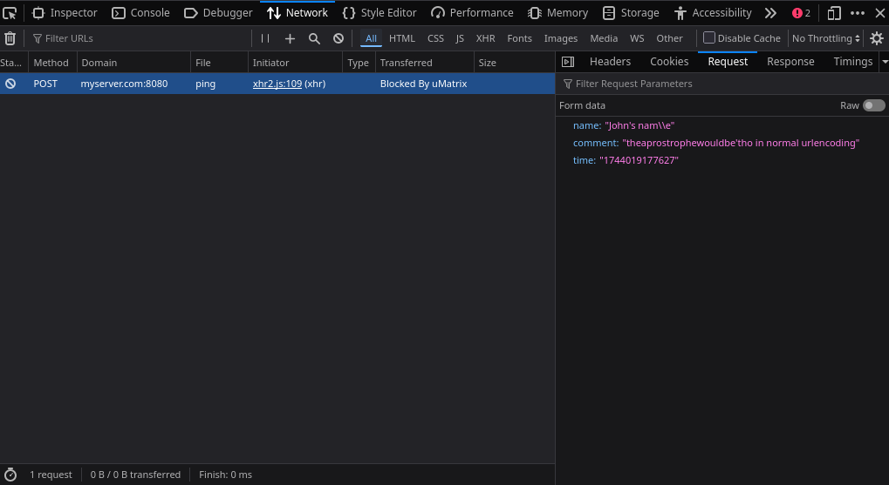
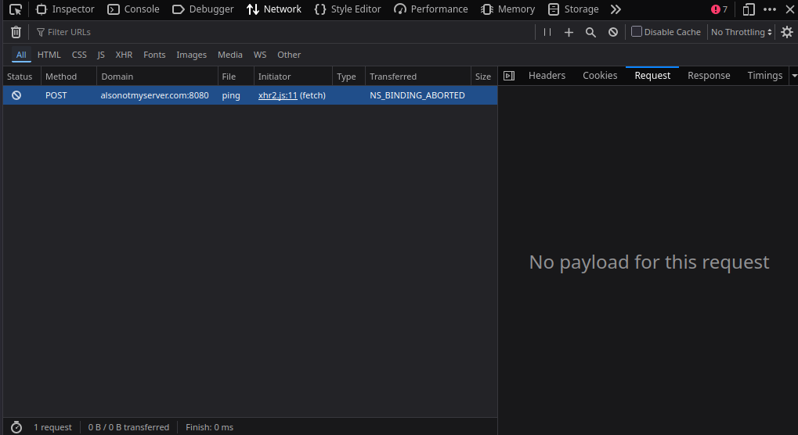
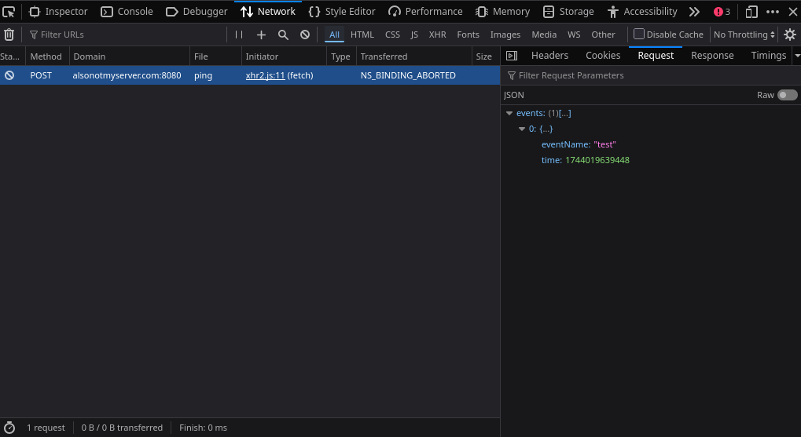
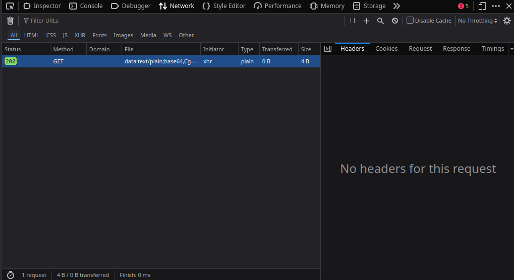
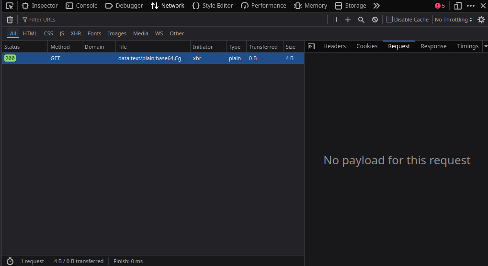
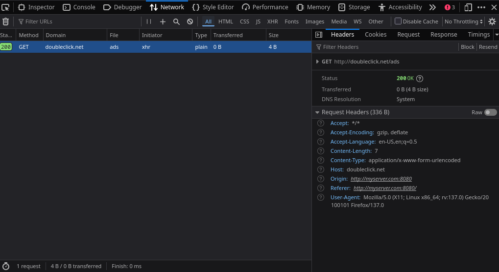
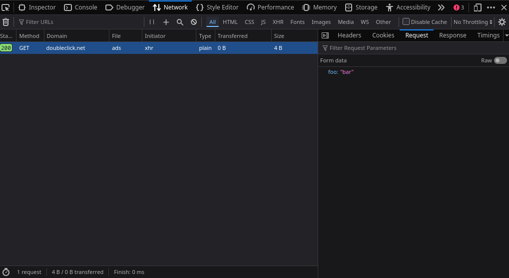

# Firefox Blocked Request Patch proof-of-concept

This is a proof of concept patch that enhances Firefox’s Netmonitor to show the original request payload in the UI (and ensure the URL, and headers are also visible in the Headers tab) even if the request hasn't completed yet, for requests blocked by extensions or other mechanisms (e.g., CSP, network errors).

## Features
- Preserves the original request URL
- Captures and displays request payload for blocked requests - this was empty in Firefox 137.
- Captures and displays request headers for blocked requests - this was already showing for most cases (but not for CSP-blocked requests which show as data channels in Firefox 137).
- Started as a fix for extension-blocked requests (e.g., ad blockers) to see their request's payload, but now applies to any blocked request, that I'm aware of, however the CSP-blocked requests always show a `GET` method and status 200 OK.

## Screenshots (Firefox 137.0b10 in Arch Linux)
**The payload of requests blocked by an extension, uMatrix in this case:**  
- Before patch:  

-After patch:  

**The payload of requests blocked due to `NS_BINDING_ABORTED`:**  
- Before patch:  

- After patch:  

**A CSP-blocked request:**  
- Before patch is shown as a fake status `200` with a hardcoded(fake) method of `GET`(not `POST` which is the actual):  

- After patch both Headers and Request payload are shown and also the url but the `GET` and the status `200` remained intact and thus still fake):  

## Disclaimer
I know nothing about Firefox source code or its internals (XPCOM, channels, etc.) but anything that I know so far is what I've picked up during the making of this patch which was built with heavy help from xAI’s Grok 3 and Grok 2 over the course of a week or more. It works (for me), but is likely sloppy, miss obvious best practices, or lack polish that any dev would catch.  

## License
Licensed under the Mozilla Public License 2.0 (MPL 2.0) just like the Firefox source code. See `LICENSE` for details.

## Updates
Future tweaks will live here: https://github.com/dare3path/ff-req-show
Original Bugzilla bug: [link once filed]
